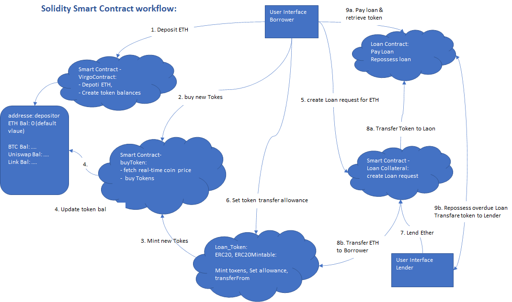

Columbia | FinTech

# Project 3: virgoDeFi in Solidity

# Overview

The project aims to build a DeFi application where users can purchase and manage crypto and use their tokens as collaterals for loans.
The application is built using smart contracts on Solidity. Users can deposit Ethereum into the contract and can initiate a process to book a loan against his/her deposit,
the user can borrow ETH against Crypto holdings subject to a 50% LTV threshold.

# Introduction

The breakout of the cryptocurrency and blockchain markets during the last decade created one of the most disruptive forces in 
the global financial markets.

The concept of tokenization is now being applied across different industries in what blockchain enthusiasts are calling the
decentralization of the financial markets. This allows investors to use different crypto assets as collateral for loans.
Crypto investors can now access cash tied to their crypto assets without necessarily selling their cryptocurrencies.

Short for decentralized finance, DeFi is an umbrella term for financial services offered on public blockchains. 
Like traditional banks, DeFi applications allow users to borrow, lend, earn interest, and trade assets and derivatives, 
among other things. The collection of services is often used by people seeking to borrow against their crypto holdings to 
place even larger bets.

  <b> ENVIRONMENTAL PREREQUISITES </b>

THe following are tools used for the projects: 

* [Remix IDE](https://remix.ethereum.org) to create the contract using Solidity programming Language.

* [Ganache](https://www.trufflesuite.com/ganache) a Development blockchain with prefunded account addresses which can be uused for testing purposes. 

* [MetaMask](https://metamask.io) a Crypto wallet and gateway to blockchain apps. Download the metamask Browser extension and pin it to your favorite browser and point it to the localhost:8545 by createting a 'testnet' chain, or replace the port with what you have set in your workspace.

# Design

  <b> Design </b>

The Project integrates 6 smart contracts that combine to provide full customer functionality.

Virgo Contract ==> Oracle ==> Buy Token ==> Loan Token ==> Collateral ==> Loan​

# Virgo Contract

  <b> Virgo Contract </b>

[`virgoContract.sol`](virgoContract.sol) -- virgo contract creates the Crypto Portfolio and Token Specific Account Tracking​. It achieves the following:

•	Allow users to deposit ether

•	Map the sender address to their respective coin balance

•	With the contract, we can update the users’ coin balances with the equivalent token and

•	Finally the contract reduces the ether balance with the amount of token purchased

# Buy Token Contract

  <b> Buy Token </b>

[`Oracle.sol`](Oracle.sol) ---This contract contains real-time pricing feeds.

[`buyToken.sol`](buyToken.sol) -- This contract calls Oracle.sol when the user is buying the token and uses the pricing from the Oracle.sol contract to determine the number of token the user can buy.

It achieves the following:

•	Import real-time market prices using Kovan Network

•	Tests sufficient account balance

•	Buy Tokens based on user’s token Symbol (e.g. BTC, UNI or LINK) along with the ETH Buy Amount

•	Use ERC-20 to mint tokens via [`loanToken.sol`](loanToken.sol)
	
•	Calculates no of Tokens to be minted by dividing ETH BuyAmount / TokenPrice

# Loan Token Contract

  <b> Loan Token​ </b>

[`loanToken.sol`](loanToken.sol) ---This contract achieves the following :

•	Issues Fungible Tokens following ERC20 and ERC20Mintable standards 

•	Token minted: Bitcoin, Uniswap, LINK 

•	Token approves address spending allowances to support ‘transferFrom’ functionality

# Collateral Contract

  <b> Collateral​ </b>

[`collateral.sol`](collateral.sol) ---This contract achieves the following :

•	Creates loan request object based on user's token collateral, collateral amount, loan amount, payoff amount and duration

•	Loan object imported from [`loan.sol`](loan.sol)

•	Provides function for a lender to accept loan request and transfer ETH

# Loan Contract

  <b> Loan​ Contract </b>

[`loan.sol`](loan.sol) ---This contract achieves the following :

•	Creates Loan Object with attributes:  
		1.Borrower  
		2.Lender  
		3.Collateral amount  
		4.Loan amount  
		5.Payoff amount  
		6.Loan Duration  

•	Pay Loan: Repay the ETH payoff amount and transfer token collateral back to borrower

•	Repossess Loan: Overdue Loan closed and transfer token collateral to Lender

# Process workflow

  <b> Workflow </b>

	
Below is a practical walk-through of the steps involved to create a virgoDeFi account and borrow ETH.

## Before You Start  
• Open Solidity files in Remix  
	
• Switch to local network  
	
• Set `msg.sender` to your account  

## Opening Your Account  
• [`virgoContract.sol`](virgoContract.sol) allows you to open token accounts and track your balances  
	
• First compile and deploy [`virgoContract.sol`](virgoContract.sol)  
	
• To deposit ETH: set `msg.value` to deposit amount, click `Deposit` button and enter ETH deposit amount  

• ETH deposit will be transferred to [`virgoContract.sol`](virgoContract.sol)

• Check `userBalanceETH`, `userBalanceBTC`, and `balanceContract`  

## Buying Tokens  
• Compile and deploy [`buyToken.sol`](buyToken.sol) providing the [`virgoContract.sol`](virgoContract.sol) address  
	
• For live prices, switch to Kovan testnet with an account containing sufficient ETH balance  
	
• Compile/Deploy [`buyToken.sol`](buyToken.sol)  
	
• Go to `GetLivePrice` and enter `BTC`, `UNI` or `LINK` to get live prices  
	
• Note that prices are quoted in Wei  
	
• To actually buy tokens switch back to Local network with appropriate account  
	
• Redeploy [`buyToken.sol`](buyToken.sol)  
	
• Click `buyTokens` and enter token symbol (`BTC`, `UNI` or `LINK`) and buy amount in `ETH`, then transact. New tokens will be minted and automatically transfer to  [`virgoContract.sol`](virgoContract.sol). User balances will also update.  
	
• In case of insufficient `ETH` balance, transaction will be rejected  
	
• Check `noTokens` to see the number of tokens for the `ETH` purchase amount based on the token price  
	
• Go back to [`virgoContract.sol`](virgoContract.sol) and check the relevant balanceUser (eg `balanceUserBTC` for BTC purchase) and `balanceUserETH` which should show reduced `ETH` balance to reflect purchase  
	
• At [`buyToken.sol`](buyToken.sol) click `token` to copy new token address. Change `CONTRACT` to `Token` and enter the token address `At Address`. Then open the new `token` appearing at the bottom  
	
• Check user’s `balanceOf` which should reflect purchased tokens  
	
• Check `allowance` (owner = buyToken, spender = user) which should be 0  
	
• Repeat process for other tokens. Note that in this version each purchase results in a new token mint, ie repeat token purchases are minted separately  

## Borrowing Against Crypto  
• Set `msg.sender` to borrower  
	
• Compile [`collateral`](collateral.com) then deploy `loanRequest` providing [`virgoContract.sol`](virgoContract.sol), [`token`](token.sol) addresses and relevant loan parameters (all in 18 decimals units, like `Wei`)  
	
• `loanRequest` verifies that the implied LTV <= 50% and that user (`msg.sender`) has sufficient token balance to support the collateral amount  
	
• If successful, a new `loanRequest` object is created in the lefthand column  
	
• Before the `loanRequest` can be accepted, the user needs to approve the new `loanRequest` contract’s ability to transfer the borrower’s tokens as collateral to a new loan contract: 
	
• Open [`token`](token.sol) in lefthand column and click `Approve` entering the following details  
  `Spender` = `loanRequest` contract address  
  `Amount` =  collateral amount of `loanRequest`  
	
• Confirm the approval of the collateral amount by verifying `Allowance`:  
  `Owner` = user  
  `Spender` = `loanRequest` contract  
	
• To accept the `loanRequest`, change `msg.sender` to the `lender` address  
	
• Then re-open `loanRequest`  
	
• Check `At Address` field is empty  
	
• Enter `msg.value` = requested loan amount and click `LendEther` button of `loanRequest` to accept and issue the loan  
	
• Upon successful completion, collateral tokens will be transferred from borrower to the new loan contract, the `Lender`’s ETH balance will be reduced by loan amount which is transferred to [`virgoContract`](virgoContract.sol) while the borrower’s token and ETH balances are updated (can be verified via the balance functions of [`virgoContract`](virgoContract.sol)  

## Repaying/Repossessing The Loan  
• Open the new [`loan`](loan.sol) object by copying the `loan` object address under `loanRequest`, change `CONTRACT` field to `Loan`, and entering the `loan` object address in `At Address`. The `loan` object will appear in the lefthand column  
	
• The loan can be repaid anytime before the due date. Check `Fakenow` for current time and check `dueDate`. `fastforward` shifts 400 days forward.  
	
• To repay the loan, set `msg.sender` to the borrower (though technically anyone can repay the loan). Set `msg.value` to loan `payoffamount` amount and click `payLoan`  
	
• Borrower will transfer `ETH` payoff amount to the `loan` contract which via `selfdestruct` will transfer ETH back to the Lender  
	
• The borrower will receive the token collateral back, and a reduced ETH balance to reflect loan payment, both reflected in [`virgoContract`](virgoContract.sol) user balances  
	
• Loans that are not repaid before the due date are subject to repossession whereby token collateral is transferred from loan contract to the lender  
	
• To test this, due to `selfdestruct`, we need to first re-issue another loan on same terms:  
	
• Set `msg.sender` to Lender  
	
• Open existing 'loanRequest`  
	
• Check `At Address` empty  
	
• Set `msg.value` to loan amount and click `LendEther`  
	
• Open the new [`loan`] object by copying the `loan` object address under `loanRequest`c 
	
• Change `CONTRACT` field to `Loan`  
	
• Enter new `loan` address (in `loanRequest`) in `At Address` field, loan contract appears in left hand column  
	
• set `msgSender` to Lender  
	
• Check `Fakenow` & `dueDate`  
	
• `FAST FORWARD` past `dueDate`  
	
• click `repossess`. Lender token balance under `Token` should now reflect the collateral as balance  

# Future Enhancements

  <b> Future Enhancements </b>

## Current Code  

•	Enhanced error catching

•	Enhanced security (Reentrancy etc)

•	virgoContract general ledger balances for all tokens

•	no re-minting for repeat token purchases

## Features beyond current code  

•	User Interface (UI)
	
•	Crypto sales

•	Enhanced loan functionality incl. periodic interest payments, LTV liquidation triggers
	
•	Integrate with liquidity provider, eg ETH-wrapped Crypto
	
•	Crypto lending 
	
•	Crypto staking

•	Option to transact in Fiat Currency
	
•	Expand Crypto Range​

# Resources ---link to video

 [Video Demo Link](https://1drv.ms/p/s!Aola6McPYvrQnxL7-1Lv4MUn2mCj)

